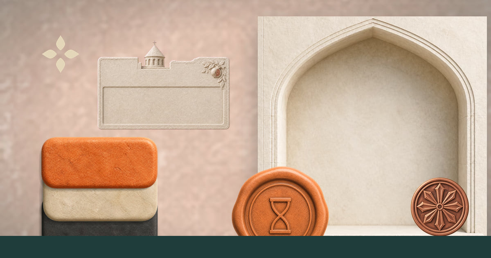
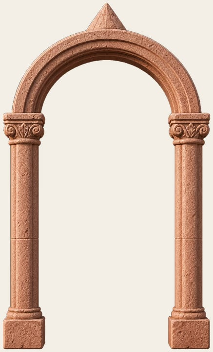
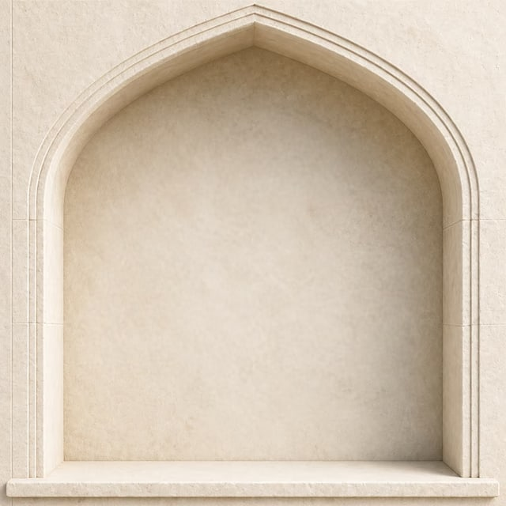
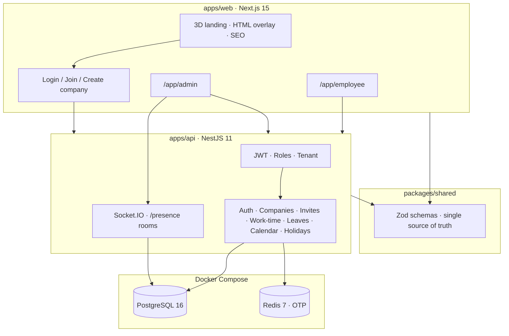

<p align="center">
  
</p>

<h1 align="center">Teamora</h1>

<p align="center">
  <strong>Human capital, calmly managed</strong><br>
  <em>سرمایه انسانی، بی‌هیاهو</em>
</p>

<p align="center">
  A multi-tenant HR system for hours, leave, and calendar —<br>
  built as a real product, not a tutorial CRUD app.
</p>

<p align="center">
  
  
  
  
  
  
  
  
</p>

<p align="center">
  <a href="#برای-منابع-انسانی">فارسی</a> ·
  <a href="#product">Product</a> ·
  <a href="#architecture">Architecture</a> ·
  <a href="#engineering">Engineering</a> ·
  <a href="#run-locally">Run</a>
</p>

<p align="center">
  
</p>

---

## برای منابع انسانی

تیمورا یک **سامانهٔ واقعی مدیریت منابع انسانی** است، نه یک تمرین دانشگاهی.

مدیر شرکت را می‌سازد. کارمند با **کد دعوت شش‌رقمی** وارد همان شرکت می‌شود — نه با ثبت‌نام عمومی. ساعات کار با شروع/پایان روز ثبت می‌شود و برای تأیید می‌رود. مرخصی گردش‌کار دارد. تقویم جلسات را با مرخصی تأییدشده **تداخل‌یابی** می‌کند. حضور همکاران روی WebSocket، زنده است.

محصول برای **فارسی (راست‌چین + تقویم شمسی)**، **ارمنی** و **انگلیسی** طراحی شده. لندینگ یک روایت سه‌بعدی است؛ متن اما HTML واقعی است تا گوگل بتواند فارسی و ارمنی را ایندکس کند.

| آنچه در محصول می‌بینید | مهارتی که پشت آن است |
| --- | --- |
| چند شرکت، دادهٔ جدا | طراحی سیستم چندمستأجری |
| ورود با رمز، ایمیل OTP، گوگل | امنیت احراز هویت |
| حضور زنده در داشبورد مدیر | ارتباط بلادرنگ |
| تداخل جلسه و مرخصی | منطق دامنه، نه فقط CRUD |
| fa / hy / en | بین‌المللی‌سازی واقعی (فونت، جهت، تقویم، SEO) |
| لندینگ حیاط و ایوان | طراحی محصول + Three.js + عملکرد وب |

مخزن: [`MoAshouri/Teamora`](https://github.com/MoAshouri/Teamora)

---

## Product

Teamora is an HR workspace for small companies that need one calm place for **time**, **leave**, and **calendar**.

An admin creates a company space. Employees join with a six-digit invite — the company is a courtyard, not an open signup form. The employee starts and ends the day. The admin sees who is present, reviews hours and leave, and schedules events. If someone is already on approved leave, the calendar says so.

Two rooms, one house:

<p align="center">
  
</p>

| | Admin | Employee |
| --- | --- | --- |
| Space | Sidebar hall, light theme | Phone-first bottom nav, dark theme |
| Join | Registers the company | Enters with an invite token |
| Hours | Reviews entries, live presence | Start day / end day |
| Leave | Approve or reject | Request + remaining balance |
| Calendar | Events + conflict flags | Upcoming sessions |

Locales: **`/fa`** · **`/hy`** · **`/en`**

---

## Visual language

This is not a generic SaaS skin. The UI is tactile architecture — Hayat (courtyard, public arrival) and Gavit (inner hall, trust). Product ideas are objects, not screenshots:

<p align="center">
  
</p>

<table>
  <tr>
    <td align="center" width="25%">
      <br>
      <sub>Hours — the week stacks like bricks</sub>
    </td>
    <td align="center" width="25%">
      <br>
      <sub>Leave — approval is a wax seal</sub>
    </td>
    <td align="center" width="25%">
      <br>
      <sub>Calendar — seven niches, one for rest</sub>
    </td>
    <td align="center" width="25%">
      <br>
      <sub>Company — each tenant is its own courtyard</sub>
    </td>
  </tr>
</table>

The marketing page is a **scroll-driven Three.js walk** (React Three Fiber, GSAP, Lenis). Copy stays in the DOM: crawlers, RTL, and `prefers-reduced-motion` still get a complete page. WebGL is atmosphere. HTML is the product.

---

## Architecture



Every mutating route is stacked the same way: **who you are**, **which company you belong to**, **whether your role may do this**.

```ts
@UseGuards(JwtAuthGuard, TenantGuard, RolesGuard)
```

---

## Engineering

Decisions that are already in the code — not a slide deck.

**Contracts, not duplicated DTOs.** `packages/shared` exports Zod schemas for auth, work policy, time entries, leave, and calendar. Nest parses the same shapes the web app will send.

**Tenancy is a guard, not a query afterthought.** `companyId` is derived from the JWT user (admin owns one company; employee has one membership). List endpoints scope by tenant. WebSocket clients join `company:{id}` and cannot see another courtyard.

**Auth is three doors, one cookie.** Password (email or username), email OTP stored in Redis with TTL, Google OAuth. JWT is an **httpOnly** cookie (`SameSite=lax`, `Secure` in production). bcrypt cost 12. Invite codes are six-digit tokens with max uses and expiry.

**Realtime is presence, not a toy echo.** Clock-in / clock-out emits into the company room. The admin dashboard subscribes and refreshes who is at work.

**Calendar has a domain rule.** Events carry attendees. Approved leave that overlaps an attendee is returned as a conflict — so scheduling is not a dumb date picker.

**Calendars are not an afterthought.** Storage is UTC. The UI formats Jalali for Persian and Gregorian for Armenian/English. Work weeks start Saturday in `fa`, Monday in `en`/`hy`. Holidays seed Iran and Armenia.

**i18n is a layout concern, not a JSON dump.** Each locale loads **one** font: Estedad (Persian, self-hosted variable), Noto Sans Armenian, Inter. `lang` / `dir` are set per route. Landing metadata includes canonical URLs, hreflang, Open Graph, Twitter cards, JSON-LD, `sitemap.xml`, and `robots.txt` that keeps `/app` out of the index.

**Performance and access.** The 3D story skips itself when WebGL is missing, GPU is weak, or the user asks for reduced motion. AVIF brand kit, `next/font` with `display: swap`, image formats AVIF/WebP.

**Ship shape.** pnpm workspaces, Prisma migrations + seed, Docker Compose for Postgres, Redis, API, and web.

---

## Repository

```
teamora/
├── apps/web          Next.js 15 · React 19 · next-intl · R3F
├── apps/api          NestJS 11 · Prisma · Passport · Socket.IO
├── packages/shared   Zod contracts used by both apps
├── docs/readme       README stills (this page)
└── docker-compose.yml
```

| App | Stack | Responsibility |
| --- | --- | --- |
| `@teamora/web` | Next.js 15, React 19, next-intl, Three.js, GSAP, Lenis, socket.io-client | Marketing, auth UI, admin/employee shells |
| `@teamora/api` | NestJS 11, Prisma, PostgreSQL, Redis, Passport, Socket.IO | Auth, tenancy, HR domain, presence |
| `@teamora/shared` | TypeScript + Zod | Request/response contracts |

### API map

| Area | What it does |
| --- | --- |
| `auth` | Register admin, login, OTP, Google, join-by-invite, `me`, logout |
| `companies` | Company profile, work policy (hours, weekdays, `Asia/Tehran`) |
| `invites` | Admin creates 6-digit codes |
| `users` | Profile; admin lists people in the tenant |
| `work-time` | Session start/end, entries, review, weekly hours, live sessions |
| `leaves` | Create, list, pending, review, annual balance |
| `calendar` | Events, attendees, leave-conflict detection |
| `holidays` | Jalali / Gregorian, IR / AM |
| `/presence` | JWT-gated Socket.IO rooms per company |

---

## Internationalization & SEO

| Locale | Route | Direction | Type | Calendar default |
| --- | --- | --- | --- | --- |
| Persian | `/fa` | RTL | Estedad | Jalali |
| Armenian | `/hy` | LTR | Noto Sans Armenian | Gregorian |
| English | `/en` | LTR | Inter | Gregorian |

Headlines live in HTML. The canvas is `aria-hidden`. That is deliberate: a WebGL-only landing would be invisible to search and to anyone who cannot run a GPU.

---

## Roadmap

Built to be extended, not rewritten.

| Now | Next | Later |
| --- | --- | --- |
| Multi-tenant HR core | i18n inside `/app` (shell is Persian-first today) | Payroll & overtime |
| Auth × 3 + invites | Departments and finer roles | Shift templates |
| Hours, leave, calendar | Email / in-app notifications | Exports and reports |
| Live presence | Automated tests and CI | PWA |
| 3D marketing + SEO | Production deploy | Attachments on leave |

---

## Run locally

**Need:** Node.js 20+, pnpm 9+, Docker.

```bash
cp .env.example .env
cp .env apps/api/.env

docker compose up -d postgres redis
corepack enable
pnpm install

pnpm --filter @teamora/shared build
pnpm db:generate
pnpm db:migrate
pnpm db:seed
pnpm dev
```

- Web: [http://localhost:3000/fa](http://localhost:3000/fa)
- API: [http://localhost:4000](http://localhost:4000)

Google OAuth needs `GOOGLE_CLIENT_ID` / `GOOGLE_CLIENT_SECRET`. Without SMTP, OTP codes print in the API log.

To run the full stack in containers: `docker compose up --build`.

---

<p align="center">
  
</p>

<p align="center">
  <strong>Mohammad Ashouri</strong><br>
  Full-stack product engineering — TypeScript, Next.js, NestJS, systems that stay calm under real rules.<br>
  <a href="https://github.com/MoAshouri">github.com/MoAshouri</a>
  ·
  <a href="https://github.com/MoAshouri/Teamora">Teamora</a>
</p>
